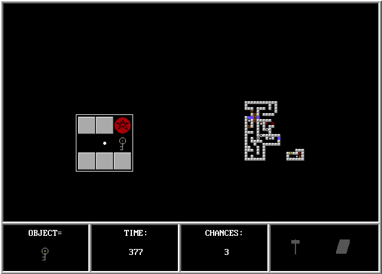

LABYRNTH
--------

Labyrnth is a game I wrote when I was just starting to learn to program
computers. It's the only remaining piece of work I have from that period of my
life, so I'm keeping it here for posterity (the reason it survived is that I
posted it to some game boards and BBSs which over time have become websites like
[www.qbasic.com](http://www.qbasic.com)).

I also like to keep it around as a reminder to myself that you don't need to be
a great coder to produce something... magical. This code has almost no
sub-routines, lots of gotos, and a metric ton of case statements, but it allowed
me to bring a vision in my teenage head into reality. Writing clean,
well-factored, documented code is important, but writing code that _does the job_
more so.

The original game is comprised of LABYRNTH.BAS and LABLEVEL.DAT, and you need a
[MS-DOS emulator](http://www.dosbox.com/wiki/Main_Page) and
[QBASIC](http://www.softpedia.com/progDownload/Qbasic-Download-50470.html) in
order to run it.

	C:\LABYRNTH> QBASIC LABYRNTH.BAS

then F5 to run. You _must_ run the game in the directory that contains the .BAS
and .DAT file. Read LABYRNTH.TXT for a description of the game and instructions
on how to play.

All three of the original files remain exactly as they were when I uploaded the
game almost two decades ago, unedited, warts and all.

